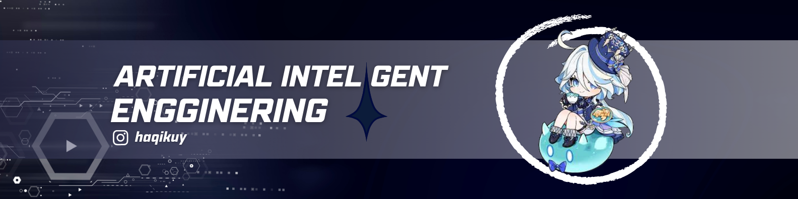

# HELLO EVERYONE 👋
### I AM MOH DHIYAULHAQ ULUMUDDIN

**NOW I AM STUDYING IN STATE UNIVERSITY OF MALANG**

 

## ABOUT ME

 

 

  
  
  
  
  
  
  
  
  
  

  
  
  
  
  
  
  
  

  
  
  
  

  
  
  
  
  
   
  
  
  

 

  
  
  
  
  
  
  

 

  <table align="center">
    <tr>
      <td colspan="2" align="center">
        
      </td>
    </tr>
    <tr>
      <td colspan="2" align="center">
        
      </td>
    </tr>
    <tr>
      <td width="50%" align="center">
        
      </td>
      <td width="50%" align="center">
        
      </td>
    </tr>
    <tr>
       <td width="50%" align="center">
        
      </td>
      <td width="50%" align="center">
        
      </td>
    </tr>
  </table>

 

 

 

 

